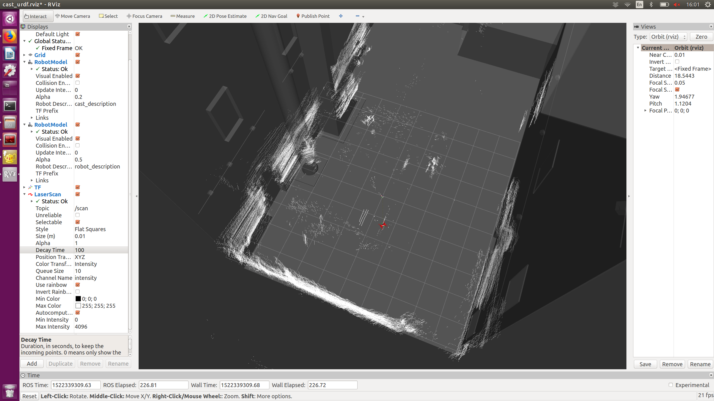

# Description
This repository contains the code to use the Burdick Lab Intel Drone. Please don't include data in this repository and use the dedicated repository instead.

All possible set of commands are listed in the scripts folder. Use it as a reference or execute a file using bash.

# Setup
- Turn on the radio (if you forget to turn on the radio first, you have to press the turn it on while holding the bind button. A mayor tone indicates success while a minor tone (sad tone) indicates failure. Try again if it fails)
- Turn on the drone
- ssh into the drone
```console
  $ ssh bgroupintel@192.168.1.61
```
- execute the optitrack and mavros nodes inside the drone. This command will start the mavros nodes and Optitrack node inside the drone. The bintel asset should be selected in motive. Check 'Z-up' and vrpn is on in motive.
```console
 (bintel) $ roslaunch mavros_optitrack.launch
```
- check that the time difference is small:
```console
  $ ntpdate -q other_computer_ip
```
- run ntp server to correct any time issues:
```console
 (bintel and host) $ sudo ntpq -p
```
- Open QGroundControl. Check that the radio commands appear on the radio tab. Keep QGroundControl Open and the volume in your laptop max: if there is any error QGroundControl would speak the error. 


If you cannot see the topics from one machine to another make sure that the connectivy works:
- Set up ROST_HOSTNAME and ROS_MASTER_URI
```console
  export ROS_MASTER_URI=http://192.168.1.61:11311 # this assumes the drone is master
  export ROST_HOSTNAME=192.168.1.YOURIP:11311 
```
- YOURIP is your network IP as seen when ifconfig is executed. If you are using a new computer your should fix your IP within the router to avoid conflicts. Go to the router admin page -> advanced -> LAN -> add IP
- ping between the two machines

To visualize the drone within CAST you have to run their urdf models. Run the launch file and check that the movement matches reality (for example, get close to a column in real life and it should do the same in RVIZ).
```console
  (host) $ roslaunch urdf/cast_models.launch robot_urdf:=urdf/inteldrone_down.urdf
```



It will define the frames for the bintel, CAST and it will define the static tf between them. In addition, it will launch a rviz instance with the right configuration. 
**NOTE:** if the CAD models or the frames are red it means optitrack is not publishing the correct pose. Check that the node is working.


# Operation

## Manual Control

+ To arm push the left stick to the bottom right. 

## Position Control

Once everything has been checked, you are good to fly. The left lever at the back in the radio controls the mode. For position control, set the mode to the middle option before arming (the modes appear in QGroundControl). If Optitrack 

+ IMPORTANT: in manual mode the left stick controls thrust. The bottom means idle thrust and it should hover with ~60%. However, in position mode the left stick controls vertical speed. Zero speed is 50%.

Be ready to take manual control of the drone at any time

## Off-board mode

OPTION 1
+ Arm the drone in position mode. 
+ Start a script publishing to command the drone, either /mavros/setpoint_position/pose or /mavros/setpoint_attitude. Make sure to publish at a high rate (>~20HZ??)
+ Change to off-board mode in the radio. If you change to off-board mode before publishing it would reject the mode

OPTION 2
Run the python file
```console
$ python  	mavros_offboard_posctl_test.py
```
The waypoints are written in the file.


# Extra commands
## Increasing the Data Stream Rate
To increase the stream rate at the IMU (mavros/imu/data) and the motor commands (mavros/rc/out), run the following commands in ros:


IMU:
```console

  $ rosrun mavros mavcmd long 511 105 10000 0 0 0 0 0

  $ rosrun mavros mavcmd long 511 31 10000 0 0 0 0 0
```

Controls:
```console
  $ rosrun mavros mavcmd long 511 36 10000 0 0 0 0 0
```

Where the numeric parameters are specified in:
  https://mavlink.io/en/messages/common.html#MAV_CMD_GET_MESSAGE_INTERVAL (1st parameter)
  https://github.com/PX4/Firmware/blob/4453e4201b7a245cff52beeb38a293161aea4c48/Tools/mavlink_px4.py#L506 (2nd parameter)
  
The third numeric parameter is the interval between messages specified in microseconds. 

To run all commands at once run the script:
```console
$ ./increase_rates.sh
```


## Setting up SSH keys

To avoid inserting the password everytime you ssh using ssh-key authentification. This will copy your public key to the bintel drone, enabling passwordless secure connection.

```console
  $ ssh-copy-id -i ~/.ssh/mykey bintel@192.168.1.61
```
If you haven't created a ssh-key for your computer, use:

```console
  $ ssh-keygen -t mykey
```
where mykey is your name.

For extra convenience, create an alias, for example bintelconnect:
```console
  $ alias bintelconnect='ssh bintel@192.168.1.61'
```
The bash file add_to_bashrc.sh copies useful commands to your bash file.

## Setting Up Optitrack for Positioning
To use Optitrack for positioning using ecf-EKF, first remap the vrpn topic publishing pose to /mavros/vision_pose/pose. This is done when running the launch file mavros_optitrack.launch (which then runs vrpn_optitrack_positioning.launch which remaps the topic). Then, set the following parameters in QGroundControl:
- EKF2_AID_MASK: Check vision position fusion, vision yaw fusion (uncheck everything else)
- EKF2_HGT_MODE: Vision
- SYS_MC_EST_GROUP: eclEKF

The pose from the Optitrack system will now be fused with other sensors to estimate the position and orientation of the drone. Therefore, when booting the drone, its coordinate frame must be alligned with the Optitrack reference frame. Furthermore, the positioning can be verified by comparing the output of the topics /mavros/vision/pose and /mavros/local_position/pose. These topics should track each other closely. 

For more details see: https://dev.px4.io/en/ros/external_position_estimation.html (The reference uses LPE instead of ecfEKF, both methods should work equally well, LPE requires firmware modifications to activate the correct modules). 

When positioning through Optitrack is up and running, control can be offboarded as described in the PX4 documentation: https://dev.px4.io/en/ros/offboard_control.html. An example in C++ is also included in the documentation: https://dev.px4.io/en/ros/mavros_offboard.html
